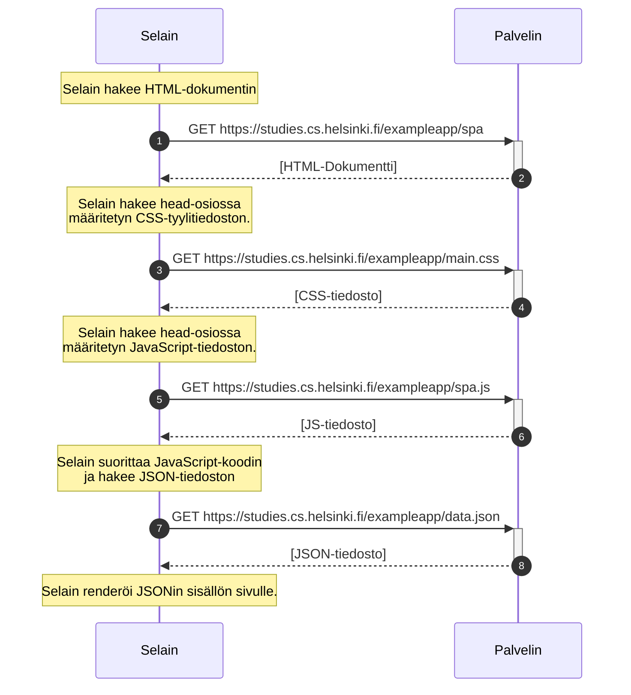

Tehtävä 0.5: Single Page App

```mermaid
sequenceDiagram
    participant S as Selain
    participant P as Palvelin
    autonumber

    %% HTML
    Note over S: Selain hakee HTML-dokumentin
    S->>+P: GET https://studies.cs.helsinki.fi/exampleapp/spa
    P-->>-S: [HTML-Dokumentti]

    %% CSS
    Note over S: Selain hakee head-osiossa <br> määritetyn CSS-tyylitiedoston.
    S->>+P: GET https://studies.cs.helsinki.fi/exampleapp/main.css
    P-->>-S: [CSS-tiedosto]

    %% JS
    Note over S: Selain hakee head-osiossa <br> määritetyn JavaScript-tiedoston.
    S->>+P: GET https://studies.cs.helsinki.fi/exampleapp/spa.js
    P-->>-S: [JS-tiedosto]

    %% JSON
    Note over S: Selain suorittaa JavaScript-koodin <br> ja hakee JSON-tiedoston
    S->>+P: GET https://studies.cs.helsinki.fi/exampleapp/data.json
    P-->>-S: [JSON-tiedosto]

    Note over S: Selain renderöi JSONin sisällön sivulle.
```
