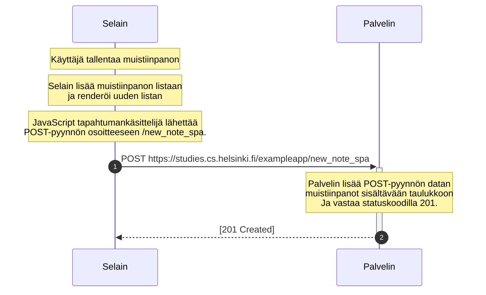

Tehtävä 0.6: Uusi muistiinpano

```mermaid
sequenceDiagram
    participant S as Selain
    participant P as Palvelin
    autonumber

    Note over S: Käyttäjä tallentaa muistiinpanon

    %% POST
    Note over S: Selain lisää muistiinpanon listaan <br> ja renderöi uuden listan 
    Note over S: JavaScript tapahtumankäsittelijä lähettää <br> POST-pyynnön osoitteeseen /new_note_spa.
    S->>+P: POST https://studies.cs.helsinki.fi/exampleapp/new_note_spa
    Note over P: Palvelin lisää POST-pyynnön datan <br> muistiinpanot sisältävään taulukkoon <br> Ja vastaa statuskoodilla 201.
    P-->>-S: [201 Created]
```
